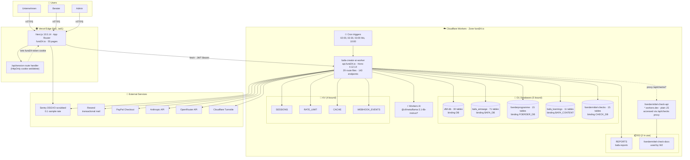
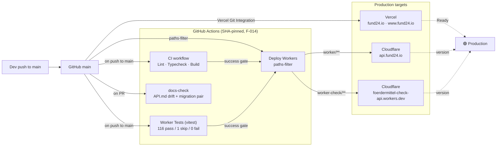

# Fund24 — Architecture

**Snapshot date:** 2026-04-15 · **Branch:** `docs/ecosystem-map` · **Commit base:** `main @ 8cf54fb`

This document is a factual snapshot. Diagrams are hand-written from direct inspection of `worker/wrangler.toml`, `worker/src/index.ts`, `.github/workflows/*`, and the frontend `app/` tree. No speculation.

---

## 1 · System Topology



**Sources of truth**
- `worker/wrangler.toml` — bindings, cron triggers, Workers AI
- `worker/src/index.ts` — middleware chain, route mounts, onError handler
- `worker/src/routes/checks.ts` — proxy to Worker 2 (`foerdermittel-check-api.froeba-kevin.workers.dev`)

---

## 2 · Auth-Flow (JWT + HttpOnly Cookie)

```mermaid
sequenceDiagram
    actor U as User
    participant FE as Next.js
    participant NR as /api/session (Next Route Handler)
    participant API as Worker · /api/auth
    participant DB as zfbf-db.users
    participant KV as KV SESSIONS

    U->>FE: Login form (email, password)
    FE->>API: POST /api/auth/login
    API->>DB: SELECT WHERE email=? AND deleted_at IS NULL
    DB-->>API: row + password_hash + salt
    API->>API: PBKDF2 100k verify
    API->>API: jose.SignJWT (HS256, 30m)
    API-->>FE: { token, user }
    FE->>NR: POST /api/session { token }
    NR-->>FE: Set-Cookie: fund24-token=JWT<br/>HttpOnly; Secure; SameSite=Lax
    FE-->>U: Redirect /dashboard

    Note over U,KV: Subsequent requests
    U->>FE: GET /dashboard/unternehmen
    FE->>FE: middleware.ts: jose.jwtVerify
    FE->>API: fetch with Bearer token
    API->>API: requireAuth: jose.jwtVerify + deleted_at guard
    API-->>FE: JSON
    FE-->>U: Rendered page

    Note over U,KV: Logout
    U->>FE: /logout click
    FE->>NR: DELETE /api/session
    NR-->>FE: Set-Cookie: fund24-token=; Max-Age=0
```

**Sources**
- `lib/api/auth.ts` — login/register/verify wrappers
- `lib/store/authStore.ts` — Zustand store, writes cookie via `/api/session`
- `app/api/session/route.ts` — Next.js route handler setting `fund24-token` HttpOnly cookie
- `worker/src/routes/auth.ts` — POST /login + signing
- `worker/src/middleware/auth.ts` — JWT verify + `deleted_at IS NULL` guard
- `middleware.ts` (Next.js) — validates cookie on protected routes

---

## 3 · Deploy-Flow



**Sources**
- `.github/workflows/ci.yml` — 2 jobs: `build` (lint+tsc+build), `test` (vitest)
- `.github/workflows/docs-check.yml` — API.md drift + migration-pair check on PRs
- `.github/workflows/deploy-workers.yml` — `cloudflare/wrangler-action@da0e0dfe…` (SHA-pinned), paths-filter `worker/**` + `worker-check/**`
- Vercel deploys via Vercel Git Integration (no GH workflow needed)

---

## 4 · Middleware Chain (Worker 1)

```mermaid
flowchart LR
    Req[Incoming Request]
    Req --> Slash[trailing-slash normalizer · 301]
    Slash --> SecHdr[securityHeaders<br/>X-Frame-Options, CSP, HSTS]
    SecHdr --> CORS[corsMiddleware<br/>env-gated allowlist]
    CORS --> CORSStrict["/api/* strictCorsCheck<br/>same-origin + allowlist"]
    CORSStrict --> CSRF[csrfProtection]
    CSRF --> RL[globalRateLimit<br/>KV-backed]
    RL --> Mount[route.match]
    Mount --> Handler[handler]
    Handler --> Err{error?}
    Err -->|yes| Toucan[Toucan.captureException<br/>DSGVO-scrubbed]
    Err -->|no| Resp[c.json]
    Toucan --> Resp
    Resp --> Out[HTTP Response]
```



**Sources**
- `worker/src/index.ts:46-59` — middleware chain
- `worker/src/middleware/{cors,security,rateLimit}.ts`
- `worker/src/index.ts:173-204` — global onError with Toucan + PII scrubber

---

## 5 · Cron & Background Work

| UTC | Pattern | Job | Service |
|---|---|---|---|
| 02:00 daily | `0 2 * * *` | D1 nightly backup → R2 `d1-backups` | `services/backup.ts` |
| 02:30 daily | `30 2 * * *` | OA-CP (Context-Guardian-Probe) + OA-VA (Variable-Audit) | `services/oa-cp.ts`, `services/oa-va.ts` |
| 03:00 Mo | `0 3 * * 1` | Audit-log + retention cleanup | `services/audit.ts`, `services/retention.ts` |
| 10:00 daily | `0 10 * * *` | Onboarding-email dispatcher (day 0/3/7) | `services/onboarding.ts` |

Source: `worker/wrangler.toml[triggers].crons`, `worker/src/index.ts::scheduled()`.

---

## 6 · Routing Composition

```mermaid
flowchart TD
    App[Hono app]
    App --> AuthR[/api/auth]
    App --> MeR[/api/me]
    App --> UntR[/api/unternehmen]
    App --> BerR[/api/berater]
    App --> BerT[/api/beratungen]
    App --> AntR[/api/antraege]
    App --> FoeR[/api/foerdermittel]
    App --> NetR[/api/netzwerk]
    App --> NachR[/api/nachrichten]
    App --> VorR[/api/vorlagen]
    App --> RepR["/api/reports /api/berichte"]
    App --> NewR[/api/news]
    App --> AdmR[/api/admin]
    App --> CheckR[/api/checks · proxy → W2]
    App --> CheckD[/api/check · direct]
    App --> Tracker[/api/tracker]
    App --> OAR[/api/oa]
    App --> GDPR[/api/user · GDPR]
    App --> Misc[branchen, promo, orders,<br/>payments, verify-payment]

    FoeR --> Favorites[favoriten.ts]
    FoeR --> Katalog[katalog.ts]
    FoeR --> MatchR[match.ts]
    FoeR --> Chat[chat.ts]
    FoeR --> Cases[cases.ts]
    FoeR --> Notif[notifications.ts]
```

Source: `worker/src/index.ts:139-163`, `worker/src/routes/foerdermittel/index.ts`.

---

## 7 · Observability

- **Sentry** (DSN hardcoded in `sentry.*.config.ts`): frontend + server + edge + worker (Toucan). `sendDefaultPii: false`, `tracesSampleRate: 0.1`, `beforeSend: sentryBeforeSend` (PII scrubber in `lib/sentry/scrubber.ts`).
- **Cloudflare Observability** enabled in `wrangler.toml` → structured logs queryable via CF dashboard.
- **Log helper** `worker/src/services/logger.ts::log(level, event, meta)` — one entry point for all Worker-side logs.
- **Frontend analytics** — `@vercel/analytics` + `@vercel/speed-insights`, gated by `fund24-cookie-consent` localStorage flag (GDPR-compliant).

---

## 8 · Versions (pinned)

| Component | Version | Source |
|---|---|---|
| Next.js | **15.5.14** ⚠️ (DoS CVE, see POST_PHASE2_AUDIT N-001) | `package.json` |
| React | 19.1 | `package.json` |
| Hono | **4.12.14** (CVE-patched) | `worker/package.json` |
| TypeScript | 5.x | both `package.json` |
| Wrangler | ^4.69.0 (worker runtime); test pool uses older (N-002) | `worker/package.json` |
| Sentry SDK | `@sentry/nextjs ^10.47.0` + `toucan-js ^4.1.1` | both |
| Node (CI + Vercel) | 20 | `.github/workflows/*`, Vercel defaults |
