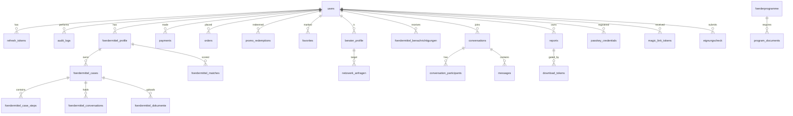
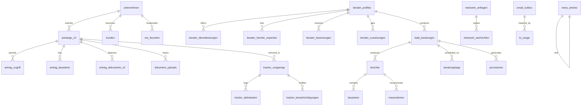
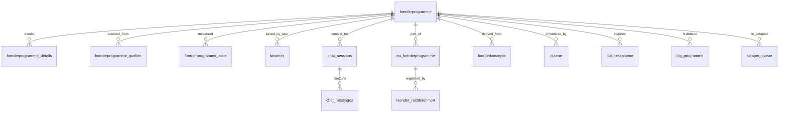
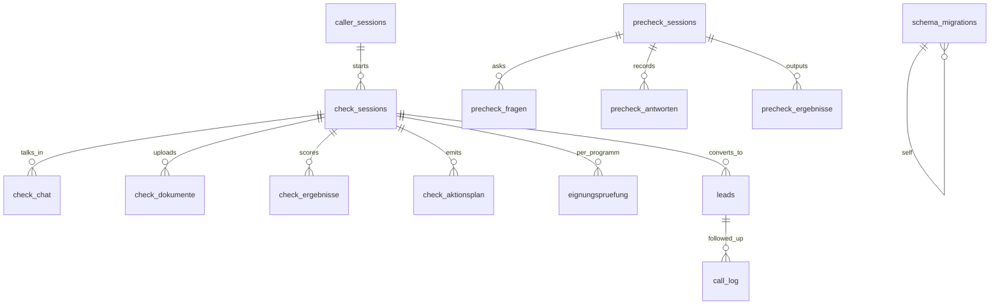

# Fund24 — Data Model

**Snapshot date:** 2026-04-15

5 D1 databases bound to `bafa-creator-ai-worker`. Cross-DB FKs are **not enforceable** in SQLite and were deliberately dropped in migrations 024-026. All cross-DB relationships are **app-layer enforced**; see section 6.

---

## 1 · Database summary

| Binding | CF name | UUID | Tables | Rows (approx, 2026-04-15) | Size |
|---|---|---|---|---|---|
| `DB` | `zfbf-db` | `9a41ed93-…c6e3` | **30** | ~24 users + ~40 audit + ~10 payments | ≪ 1 MB |
| `BAFA_DB` | `bafa_antraege` | `8582e9dd-…918f` | **71** | dominant — tracker, antraege_v2, email_outbox | 1.35 MB |
| `FOERDER_DB` | `foerderprogramme` | `b95adb7b-…5135` | **15** | 3.884 programs + 5k details + FTS | 79.2 MB |
| `BAFA_CONTENT` | `bafa_learnings` | `7f5947f7-…3b940` | **11** | ~500 prompts + learnings | 224 KB |
| `CHECK_DB` | `foerdermittel-checks` | `0b2479a3-…71ad` | **15** | wizard sessions + leads | 216 KB |

**Total: 142 tables** across the 5 fund24-relevant databases.

---

## 2 · `zfbf-db` — Identity + ownership

Core schema of `users` (abridged; for full schema run `SELECT sql FROM sqlite_master WHERE name='users'`):

```sql
CREATE TABLE users (
  id TEXT PRIMARY KEY,
  email TEXT UNIQUE NOT NULL,
  password_hash TEXT NOT NULL,
  salt TEXT,
  hash_version INTEGER DEFAULT 1,     -- 1 = SHA-256 legacy, 2 = PBKDF2
  role TEXT DEFAULT 'user',           -- 'user' | 'admin' | 'berater' | 'unternehmen'
  first_name TEXT NOT NULL,
  last_name TEXT NOT NULL,
  bafa_id TEXT,
  company TEXT,
  ust_id TEXT,
  steuernummer TEXT,
  phone TEXT,
  website TEXT,
  kontingent_total INTEGER DEFAULT 3,
  kontingent_used INTEGER DEFAULT 0,
  email_verified INTEGER DEFAULT 0,
  email_verification_code TEXT,
  email_verification_expires TEXT,
  reset_token TEXT,
  reset_token_expires TEXT,
  bafa_status TEXT DEFAULT 'pending',
  bafa_cert_status TEXT DEFAULT 'none',     -- PR #13 / GAP-001
  bafa_cert_uploaded_at TEXT,                -- PR #13
  bafa_berater_nr TEXT,                      -- PR #13
  onboarding_completed INTEGER DEFAULT 0,
  onboarding_emails_sent TEXT DEFAULT '[]',
  privacy_accepted_at TEXT,
  deleted_at TEXT,                           -- soft-delete
  profile_json TEXT,
  created_at TEXT DEFAULT (datetime('now')),
  updated_at TEXT DEFAULT (datetime('now'))
);
```

### 2.1 ER diagram — zfbf-db



**30 tables total.** Full list: `audit_logs, bafa_learnings, berater_profile, conversation_participants, conversations, download_tokens, eignungscheck, favorites, foerdermittel_benachrichtigungen, foerdermittel_case_steps, foerdermittel_cases, foerdermittel_conversations, foerdermittel_dokumente, foerdermittel_funnel_templates, foerdermittel_matches, foerdermittel_profile, forum_posts, forum_threads, gutscheine, magic_link_tokens, messages, netzwerk_anfragen, orders, passkey_credentials, payments, program_documents, promo_redemptions, refresh_tokens, reports, users.`

Note: `forum_*`, `magic_link_tokens`, `passkey_credentials` are **dead weight** from Phase C (endpoints removed in commit `18e4a54`); tables kept because migration 022 rollback is a clean `DROP TABLE` and no-one's gotten to cleaning them yet.

---

## 3 · `bafa_antraege` — Business workflow

Dominant DB by table count (71). Grouped by domain:



### 3.1 Key tables

| Table | Rows | Purpose |
|---|---|---|
| `antraege_v2` | — | Replaces `antraege`; current antrag entity with status (`entwurf\|eingereicht\|bewilligt\|abgelehnt`) |
| `antrag_zugriff` | — | Access matrix: who (berater or user) can view/edit an antrag |
| `tracker_vorgaenge` | ~7 | Case mgmt for Unternehmen, `phase` CHECK constraint against 6 allowed values |
| `bafa_beratungen` | — | Berater beratung sessions |
| `berichte` | — | BAFA report document entity (supersedes `reports` in `zfbf-db`) |
| `provisionen` | — | Commission ledger (status: `offen\|in_pruefung\|pending\|bezahlt\|storniert`) |
| `email_outbox` | — | Durable queue for transactional emails (retry + observability) |
| `news_articles` | — | Admin CMS content for `/aktuelles` |
| `foerdermittel_cases` (dup in zfbf-db) | — | The current flow writes to `zfbf-db.foerdermittel_cases` — **this copy in bafa_antraege is stale** |

### 3.2 Stale tables flagged for future cleanup

- `foerdermittel_*` duplicates in `bafa_antraege` — current code path uses `zfbf-db.foerdermittel_*`
- `antraege` (v1) — superseded by `antraege_v2` from migration 010
- `forum_*` — endpoints removed in Phase C
- `reports` in `bafa_antraege` — frontend uses `berichte` (v2) alias

---

## 4 · `foerderprogramme` — Public catalog



**15 tables.** The `foerderprogramme` table has **3,884 programs** (Bund + Länder + EU) with a combined-search index (`idx_fp_combined_search`) used by `katalog.ts`.

---

## 5 · `bafa_learnings` + `foerdermittel-checks`

### 5.1 `bafa_learnings` (11 tables)

AI pipeline artefacts: prompts (`prompts`, `prompt_versionen`, `prompt_variablen`), rules (`wording_regeln`, `qualitaetskriterien`), outcomes (`learnings`, `lernzyklen`, `optimierungen`, `ablehnungen`, `agent_residue`, `bafa_learnings`).

No user-data FKs. Written by `services/ai.ts` after each generation cycle.

### 5.2 `foerdermittel-checks` (15 tables)

State machine for the **wizard**. Main entities:



Served by **Worker 2** (`foerdermittel-check-api`) and proxied through **Worker 1** via `/api/checks/*` (see `worker/src/routes/checks.ts`).

---

## 6 · Cross-DB "foreign keys" (app-layer enforced)

SQLite **cannot enforce** cross-database foreign keys. Migrations 024–026 dropped the original FK declarations. These are the active logical relationships:

| Source | Target | Enforcement |
|---|---|---|
| `bafa_antraege.berater_profiles.user_id` | `zfbf-db.users.id` | Soft: `requireAuth` middleware rejects tokens for `deleted_at IS NOT NULL` users; orphaned rows are cleaned by the retention cron |
| `bafa_antraege.unternehmen.user_id` | `zfbf-db.users.id` | Same as above |
| `bafa_antraege.netzwerk_anfragen.(von_user_id, an_user_id)` | `zfbf-db.users.id` × 2 | Same as above |
| `bafa_antraege.bafa_beratungen.berater_id` / `unternehmen_id` | `zfbf-db.users.id` | Soft |
| `bafa_antraege.tracker_vorgaenge.user_id` | `zfbf-db.users.id` | Soft |
| `bafa_antraege.berichte.kunde_id` / `bearbeiter_id` | `zfbf-db.users.id` | Soft |
| `zfbf-db.antraege_v2.programm_id` (n/a — lives in bafa_antraege) | `foerderprogramme.foerderprogramme.id` | Soft — no constraint, JOINs happen at app layer in `services/foerdermittel.ts` |
| `zfbf-db.foerdermittel_cases.programm_id` | `foerderprogramme.foerderprogramme.id` | Soft |
| `zfbf-db.favorites.program_id` | `foerderprogramme.foerderprogramme.id` | Soft |
| `foerdermittel-checks.leads.session_id` | ← `check_sessions.id` (same DB, real FK OK) | Hard FK |

**Design rationale:** D1 doesn't attach foreign databases in the same connection, so cross-DB constraints would always fail. The soft-FK pattern was accepted in Sprint-9 as a compromise; `retention.ts` and `services/gdpr.ts` handle orphan cleanup.

---

## 7 · Migration ledger

**29 forward migrations** in `worker/db/migrations/`, all with rollback companions (CI `docs-check.yml` enforces the pair).

| NNN | Title | Target DB | Rollback quality |
|---|---|---|---|
| 001 | schema-base | zfbf-db | NOT REVERSIBLE (foundational) |
| 002 | payments-promo | zfbf-db | NOT REVERSIBLE |
| 003 | auth-tokens | zfbf-db | NOT REVERSIBLE |
| 004 | audit-logs | zfbf-db | NOT REVERSIBLE |
| 005 | legacy-migration | multiple | NOT REVERSIBLE |
| 006 | composite-indexes | zfbf-db | NOT REVERSIBLE |
| 007 | gdpr-indexes | zfbf-db | NOT REVERSIBLE |
| 008 | bafa-antraege-schema | bafa_antraege | NOT REVERSIBLE |
| 009 | email-verification-code | zfbf-db | NOT REVERSIBLE |
| 010 | funding-platform | zfbf-db + bafa_antraege | NOT REVERSIBLE |
| 011 | user-profile-json | zfbf-db | NOT REVERSIBLE |
| 012 | performance-indexes | mixed | NOT REVERSIBLE |
| 012a | performance-indexes-zfbf | zfbf-db | NOT REVERSIBLE |
| 012b | performance-indexes-bafa | bafa_antraege | NOT REVERSIBLE |
| 013 | soft-delete-learnings | bafa_learnings | NOT REVERSIBLE |
| 014 | learnings-schema | bafa_learnings | NOT REVERSIBLE |
| 015 | favorites | foerderprogramme | **Real** DROP TABLE + DROP INDEX |
| 016 | forum (removed Phase C) | bafa_antraege | **Real** — safe because code is gone |
| 017 | netzwerk | bafa_antraege | **Real** — ⚠️ live data warning |
| 018 | nachrichten | bafa_antraege | **Real** — ⚠️ live chat data |
| 019 | eignungscheck | bafa_antraege | **Real** |
| 020 | program-documents | foerderprogramme | **Real** |
| 021 | promo-unique-constraint | zfbf-db | **Real** (DROP INDEX) |
| 022 | webauthn-magic-link (removed Phase C) | zfbf-db | **Real** — safe |
| 023 | vorlagen | bafa_antraege | **Real** — ⚠️ berater templates |
| 024 | berater-profiles-drop-fk | bafa_antraege | NOT REVERSIBLE (cross-DB FK) |
| 025 | unternehmen-drop-fk | bafa_antraege | NOT REVERSIBLE (cross-DB FK) |
| 026 | netzwerk-anfragen-drop-fk | bafa_antraege | NOT REVERSIBLE (cross-DB FK) |
| 027 | bafa-cert-columns | zfbf-db | **Real** (DROP COLUMN × 3 + DROP INDEX); applied remote 2026-04-15 for GAP-001 |

See `docs/MIGRATIONS.md` for the full rollback-rules document and emergency procedure.

---

## 8 · Schema hot-spots worth watching

- **`users.bafa_cert_status`** — new column (migration 027); values: `none | pending | approved | rejected`. Admin cert-queue UI (GAP-001) mutates it; Berater upload (GAP-002) will too once shipped.
- **`antraege_v2.status`** — CHECK constraint in the table; business logic maps frontend labels (`entwurf`, `eingereicht`, `bewilligt`, `abgelehnt`, `fehlgeschlagen`) to DB values in `routes/antraege.ts`.
- **`tracker_vorgaenge.phase`** — CHECK constraint against `["vorbereitung", "antrag", "pruefung", "bewilligt", "abgeschlossen", "abgelehnt"]`. Transitions logged to `tracker_aktivitaeten`.
- **`email_outbox.status`** — `queued | sending | sent | failed`. Retry cron runs every 10 min via the onboarding cron. Admin can re-queue via `POST /api/admin/email-outbox/:id/retry`.
- **`foerderprogramme.status`** — `aktiv | abgelaufen`. Catalog queries automatically filter `!= 'abgelaufen'`.
- **`provisionen.status`** — `offen | in_pruefung | pending | bezahlt | storniert`. Admin PATCH updates + timestamps (`bezahlt_am`, `storniert_am`) auto-populated.
