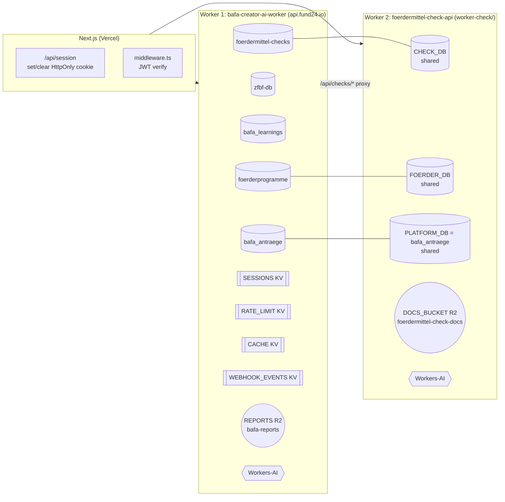

# Phase 4 — DB Mapping + Data Flows

**Branch:** `audit/phase-4-db-mapping-v2`
**Generated:** 2026-04-15
**Builds on:** Phase 1 page index + Phase 3 endpoint catalog (in-memory; sidecar JSON not yet merged into this branch's base)

---

## Executive Summary

| Metric | Count |
|---|---|
| D1 databases | **5** |
| D1 bindings across workers | 8 (3 DBs are bound to both workers) |
| Tables total (excluding `_cf_KV`, `schema_migrations`) | **141** |
| **Duplicate table names across DBs** | **19** |
| KV namespaces | 4 |
| R2 buckets | 2 |
| Data flows traced (top user journeys + crons) | 32 |
| Orphan-table candidates (no top-flow reference) | 97 (admin-only / cron-only / truly dead — mix) |
| Findings (1 critical, 5 high, 4 medium, 5 low) | 15 |

**Bottom line:** fund24 runs on **5 D1 databases with significant name collisions** — 19 tables share a name across databases. Most severe: `users` exists in both `zfbf-db` (32 columns) and `bafa_antraege` (40 columns), and worker routes query whichever DB the file-local import happens to reach. This is the structural root of Phase-1 "silent data loss" bugs and the Phase-3 "two workers, one dataset" proxy pattern. Before any schema consolidation, the ownership of each duplicated table must be decided explicitly.

---

## Databases

### zfbf-db (`binding: DB`) — 30 tables

Core auth + reports + payments + older favorites schema.

Primary tables: `users` (32 cols), `reports` (37 cols), `berater_profile` (11 cols, singular), `payments` (13 cols), `orders`, `refresh_tokens`, `passkey_credentials`, `magic_link_tokens`, `gutscheine`, `promo_redemptions`, `audit_logs`, `favorites` (4 cols), `foerdermittel_*` (8 tables — duplicates of bafa_antraege ones).

### bafa_antraege (`binding: BAFA_DB` on main + `PLATFORM_DB` on worker-check) — 71 tables

Largest DB. Shared between both workers.

Primary tables: `users` (40 cols — different from zfbf-db), `unternehmen` (34 cols, **0 indexes**), `berater_profiles` (17 cols, plural), `berater_foerder_expertise`, `berater_dienstleistungen`, `antraege` (16 cols) + `antraege_v2` (19 cols), `antrag_bausteine`, `antrag_dokumente_v2`, `antrag_zugriff`, `berichte`, `bafa_beratungen`, `provisionen`, `provisions_modelle`, `netzwerk_anfragen`, `netzwerk_nachrichten`, `netzwerk_kontakt`, `tracker_vorgaenge`, `tracker_aktivitaeten`, `news_articles`, `email_outbox`, `ki_konversationen`, `ki_usage`, `ki_verarbeitung`, `kunden`, `audit_logs` (second one), `notifications`, `eignungscheck_results`, `foerder_kombinationen`, `kombinationsregeln`, `rechtsrahmen`, `forum_*`, `bafa_custom_templates`, `bafa_phasen`, `bafa_vorlagen`.

Also duplicates of `foerdermittel_*` tables from zfbf-db (8 tables).

### bafa_learnings (`binding: BAFA_CONTENT`) — 11 tables

Content/learning DB.

Tables: `prompts` (18 cols), `prompt_versionen`, `prompt_variablen`, `wording_regeln`, `learnings`, `bafa_learnings` (7 cols, also present in zfbf-db!), `ablehnungen`, `agent_residue`, `lernzyklen`, `optimierungen`, `qualitaetskriterien`. Written by `weekly-learning` cron.

### foerderprogramme (`binding: FOERDER_DB` both workers) — 15 tables

Catalog DB, populated by scraper.

Tables: `foerderprogramme` (73 cols — wide), `foerderprogramme_details`, `foerderprogramme_quellen`, `foerderprogramme_stats`, `eu_foerderprogramme` (26 cols), `matching_profiles` (42 cols), `foerderkonzepte`, `foerderplaene`, `scraping_quellen`, `scrape_logs`, `laender_rechtsrahmen`, `chat_sessions`, `chat_messages`, `businessplaene`, `favorites` (another one).

### foerdermittel-checks (`binding: CHECK_DB` both workers) — 14 tables

Fördermittel-check session state.

Tables: `check_sessions` (20 cols), `check_chat`, `check_dokumente`, `check_ergebnisse` (23 cols), `check_aktionsplan`, `precheck_sessions`, `precheck_fragen`, `precheck_antworten`, `precheck_ergebnisse`, `eignungspruefung` (26 cols), `leads` (41 cols), `call_log`, `caller_sessions`, `password_reset_tokens` (likely legacy).

---

## Duplicate Table Names Across Databases (19)

**Critical nuance:** these are **different tables that happen to share a name**, not a replicated table. SQL queries route to whichever binding the handler holds. The collision itself is the bug.

| Table | Present in | Notes |
|---|---|---|
| `users` | zfbf-db (32 cols), bafa_antraege (40 cols) | **C-P4-01** — Different schemas. Auth flows pick one; dashboards another. |
| `audit_logs` | zfbf-db, bafa_antraege | Two audit trails, no canonical log. |
| `refresh_tokens` | zfbf-db, bafa_antraege | Identical shape — which one is authoritative? |
| `orders` | zfbf-db, bafa_antraege | Different columns (9 vs 10). |
| `favorites` | zfbf-db, foerderprogramme | Plus `foerdermittel_favoriten` + `me_favoriten` in bafa_antraege. **Four** favorites implementations total. |
| `bafa_learnings` | zfbf-db, bafa_learnings | Same shape (7 cols) in both DBs. |
| `download_tokens` | zfbf-db, bafa_antraege | |
| `reports` | zfbf-db (37 cols), bafa_antraege (17 cols) | `bafa_antraege.reports` is an OLD copy — workers now primarily use `zfbf-db.reports`. |
| `foerdermittel_benachrichtigungen` | zfbf-db, bafa_antraege | One of 8 `foerdermittel_*` duplicates. |
| `foerdermittel_case_steps` | zfbf-db, bafa_antraege | |
| `foerdermittel_cases` | zfbf-db, bafa_antraege | |
| `foerdermittel_conversations` | zfbf-db, bafa_antraege | |
| `foerdermittel_dokumente` | zfbf-db, bafa_antraege | |
| `foerdermittel_funnel_templates` | zfbf-db, bafa_antraege | |
| `foerdermittel_matches` | zfbf-db, bafa_antraege | |
| `foerdermittel_profile` | zfbf-db, bafa_antraege | |
| `netzwerk_anfragen` | zfbf-db, bafa_antraege | Different columns (6 vs 8). |
| `promo_redemptions` | zfbf-db, bafa_antraege | Different columns (6 vs 6 but distinct DDL). |
| `forum_threads` | zfbf-db, bafa_antraege | Different column counts (10 vs 12). |

---

## KV Namespaces

| Binding | Purpose |
|---|---|
| `SESSIONS` | Refresh-token mapping (user_id → rotating SHA). Written by `auth.ts`. |
| `RATE_LIMIT` | IP + endpoint → timestamp bucket. Written by `globalRateLimit`. |
| `CACHE` | Multi-purpose — `learnings:<branche>` (14d TTL), `cron:status:*`/`cron:last:*` (7d), `oa:*` (served by `/api/oa`), `health-check`. |
| `WEBHOOK_EVENTS` | Stripe idempotency: `event.id → "processed"`. |

## R2 Buckets

| Binding | Bucket | Purpose |
|---|---|---|
| `REPORTS` | `bafa-reports` | Antrags-PDFs + nightly backups. Read via `download_tokens`. |
| `DOCS_BUCKET` (worker-check only) | `foerdermittel-check-docs` | Fördercheck dokumente uploads. |

**Gap:** `BAFA_CERTS` / bucket `fund24-bafa-certs` is designed in PR #26 (open) but not bound on `main`. Berater BAFA-cert upload has no storage backend yet.

---

## Data Flows (32 top journeys)

See [`04_db_mapping.json → data_flows`](./04_db_mapping.json) for the full list. Highlights:

| # | Action | Page | Endpoint | DB · Tables |
|---|---|---|---|---|
| 1 | Register | `/registrieren` | `POST /api/auth/register` | `bafa_antraege.users`, `…email_verification_codes` |
| 2 | Login | `/login` | `POST /api/auth/login` | `bafa_antraege.users` + `…refresh_tokens` + `…audit_logs` + SESSIONS KV |
| 3 | Set session cookie | Next.js intermediary | `POST /api/session` | _(no DB — HttpOnly cookie only)_ |
| 4 | Complete foerder-schnellcheck | `/foerder-schnellcheck/bericht` | `POST /api/precheck/bericht` | `foerdermittel-checks.precheck_*` + `…leads` |
| 5 | Start auth'd Fördercheck | `/foerdercheck` | `POST /api/checks` | `foerdermittel-checks.check_sessions` |
| 6 | Chat in Fördercheck | `…/chat` | `POST /api/checks/:s/chat` | `check_chat` + `check_sessions` |
| 7 | Dokument upload | `…/dokumente` | `POST /api/checks/:s/docs` | `check_dokumente` + `DOCS_BUCKET` R2 |
| 8 | Matching | `…/ergebnisse` | `GET /api/checks/:s/matching` | `matching_profiles` + `check_ergebnisse` |
| 9 | Programmliste | `/programme` | `GET /api/foerdermittel/katalog` | `foerderprogramme.foerderprogramme` |
| 10 | Programm-Detail **(BROKEN)** | `/programme/[id]` | `GET /api/foerderprogramme/:id` (dead) | — (404 before DB) |
| 11 | Berater-Liste | `/berater` | `GET /api/netzwerk/berater` | `bafa_antraege.berater_profiles` + `…_expertise` + `…_dienstleistungen` + `…users` |
| 12 | Berater-Profil | `/berater/[id]` | `GET /api/netzwerk/berater/:id` | `berater_profiles` + `berater_bewertungen` |
| 13-16 | Onboarding (4 steps) | `/onboarding/*` | `PATCH /api/unternehmen/me` + `/api/berater/*` | `unternehmen`, `berater_profiles`, `berater_foerder_expertise`, `berater_dienstleistungen` |
| 17 | Dashboard unternehmen | `/dashboard/unternehmen` | `GET /api/dashboard/unternehmen` (CHECK base) | `users` + `unternehmen` + `foerdermittel_favoriten` + `antraege_v2` |
| 18 | Dashboard berater | `/dashboard/berater` | `GET /api/dashboard/berater` (CHECK base) | `users` + `berater_profiles` + `netzwerk_anfragen` + `bafa_beratungen` |
| 19 | Antrag detail | `/antraege/[id]` | `GET /api/antraege/:id` + dokumente + zugriff | `antraege_v2` + `antrag_bausteine` + `antrag_dokumente_v2` + `antrag_zugriff` |
| 20 | Favorit toggle | `/dashboard/unternehmen/favoriten` | `POST /api/me/favoriten/:programmId` | `foerdermittel_favoriten` (actual writer); `favorites` + `me_favoriten` likely stale |
| 21 | Bericht anlegen | `/dashboard/berater/berichte/new` | `POST /api/berichte` | `berichte` |
| 22 | Tracker Vorgang | `/dashboard/berater/tracker` | `GET/POST /api/tracker` (CHECK base) | `tracker_vorgaenge` + `tracker_aktivitaeten` + `tracker_benachrichtigungen` |
| 23 | Admin: BAFA-Cert queue | `/admin` | `GET /api/admin/bafa-cert/pending` | `berater_profiles` (bafa_cert_* cols) |
| 24 | Admin: approve cert | `/admin` | `POST /api/admin/bafa-cert/:u/approve` | `berater_profiles` + `audit_logs` |
| 25 | Admin: audit logs (orphan page) | `/admin/audit-logs` | `GET /api/admin/audit-logs` | BOTH `audit_logs` tables |
| 26 | Admin: email outbox (orphan page) | `/admin/email-outbox` | `GET /api/admin/email-outbox` | `email_outbox` |
| 27 | Checkout | `/preise` → Stripe | `POST /api/payments/stripe/*` | `payments` + `orders` + `reports` + `WEBHOOK_EVENTS` KV |
| 28 | Cron: Onboarding dispatch | scheduled 10:00 UTC | `runOnboardingDispatch` | `users` + `email_outbox` |
| 29 | Cron: OA-CP + OA-VA | scheduled 02:30 UTC | `runCP` + `runVA` | zfbf-db + bafa_antraege + `cron:status/last` KV |
| 30 | Cron: Daily backup | scheduled 02:00 UTC | `performBackup` | DB + BAFA_DB → REPORTS R2 |
| 31 | Cron: Weekly learning | scheduled Mon 03:00 UTC | weekly-learning inline | `bafa_learnings` → `learnings:<branche>` KV |

---

## Orphan-Table Candidates (97)

Tables not referenced in the 32 traced top flows. The list is heavy because admin utilities, cron-only tables, and AI-telemetry tables aren't in the top-flow sample. Manual triage required before deletion.

**Most likely truly dead** (no reference anywhere in worker routes either):
- `foerdermittel-checks.call_log`, `caller_sessions`, `password_reset_tokens` — leftover phone/voice flow
- `bafa_antraege.rechtsrahmen`, `kombinationsregeln`, `foerder_kombinationen` — planned "Kombinationsregeln" feature never wired
- `bafa_antraege.bafa_custom_templates`, `bafa_phasen`, `bafa_vorlagen` — superseded by `vorlagen` (12 cols)
- `bafa_antraege.forum_*` (3 tables) + `zfbf-db.forum_*` (2 tables) — Forum feature shelved
- `bafa_antraege.antraege` — legacy, replaced by `antraege_v2`
- `foerderprogramme.businessplaene`, `foerderkonzepte`, `foerderplaene` — no reads in any route handler

Full list in `04_db_mapping.json → orphan_tables`. **Feeds Phase 5.**

---

## High-Signal Findings (15)

### Critical (1)

| ID | Finding |
|---|---|
| **C-P4-01** | `users` table exists in BOTH `zfbf-db` (32 cols) and `bafa_antraege` (40 cols) with **different schemas**. Worker routes query whichever binding they hold locally; there is no single source of truth for who a user is. Root cause of several cross-worker data mismatches. |

### High (5)

| ID | Finding |
|---|---|
| H-P4-01 | **Four favorites stores** — `zfbf-db.favorites`, `foerderprogramme.favorites`, `bafa_antraege.foerdermittel_favoriten`, `bafa_antraege.me_favoriten`. `fund24.ts` and `check.ts` write to different ones. |
| H-P4-02 | `antraege` + `antraege_v2` coexist in `bafa_antraege`. `_v2` is the active schema; legacy remains migrated and indexed — dual-write risk on any future migration. |
| H-P4-03 | Two `audit_logs` tables (`zfbf-db` + `bafa_antraege`). No canonical forensic log. Compliance risk. |
| H-P4-04 | `berater_profile` (singular, zfbf-db) vs `berater_profiles` (plural, bafa_antraege) — name drift. Queries pick the wrong one depending on import. |
| H-P4-05 | Most `bafa_antraege` tables have 0-to-1 indexes. `unternehmen` (34 cols, **0 idx**) and `berater_profiles` (17 cols, **0 idx**) are the worst. The drop-FK migrations (024, 025) removed FKs without adding replacement indexes. |

### Medium (4)

| ID | Finding |
|---|---|
| M-P4-01 | 8 `foerdermittel_*` tables duplicated across `zfbf-db` AND `bafa_antraege`. 16 instances of near-identical schema. Guaranteed drift over time. |
| M-P4-02 | `CHECK_DB` is bound to BOTH workers. `check_sessions`/`check_chat`/`check_ergebnisse` are written only by worker-check; main worker proxies to it. |
| M-P4-03 | `BAFA_CERTS` R2 bucket NOT bound on main (designed in PR #26, unmerged). Berater cert upload has no storage. |
| M-P4-04 | `bafa_antraege.unternehmen` (34 cols, 0 idx) — any `WHERE user_id = ?` is a full scan. Fix with `CREATE INDEX idx_unternehmen_user_id ON unternehmen(user_id)`. |

### Low (5)

| ID | Finding |
|---|---|
| L-P4-01 | `ki_konversationen`, `ki_usage`, `ki_verarbeitung` in `bafa_antraege` — AI telemetry mixed with user business data. Retention unclear. |
| L-P4-02 | `rechtsrahmen` + `kombinationsregeln` + `foerder_kombinationen` — candidates for orphan-table removal. |
| L-P4-03 | `foerdermittel-checks.call_log/caller_sessions/password_reset_tokens` — phone/voice flow leftovers. |
| L-P4-04 | `foerderprogramme.foerderprogramme` has 73 cols. Scraper populates ~25; rest null on every read. |
| L-P4-05 | Daily backup dumps only `DB` + `BAFA_DB` (skips `FOERDER_DB`, `CHECK_DB`, `BAFA_CONTENT`). Restore-from-backup would lose foerderprogramme catalog + check sessions + learnings. See `worker/src/index.ts:269`. |

---

## Mermaid — Top-Level Data Layer

---

## JSON Sidecar

[`04_db_mapping.json`](./04_db_mapping.json) — full table/column info, flows, orphan candidates, findings. Feeds Phase 5 and Phase 6.

---

_End of Phase 4._
